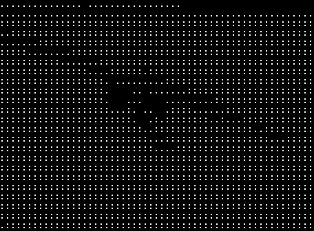

# ASCII 艺术生成器

## 🎮 这是什么？

一个专为**终端风格游戏**和**复古动画**设计的 ASCII 艺术生成工具。

在制作终端模拟器游戏、或者需要复古科技感的项目时，你可能需要在界面中插入一些 ASCII 动画效果——比如开场动画、过场画面、或者背景装饰。这个工具可以帮你快速将任何图片或视频转换成终端风格的 ASCII 字符动画。

### 适用场景

- 🕹️ **终端风格游戏** - 为游戏添加 ASCII 动画效果
- 🎬 **游戏过场动画** - 制作复古风格的开场/结束画面
- 💻 **模拟终端界面** - 为应用添加终端美学元素
- 🎨 **数字艺术创作** - 制作独特的字符艺术作品
- 📺 **复古视频效果** - 为视频添加 80-90 年代终端风格

---

## ✨ 功能列表

### 🖼️ **图片转 ASCII**
- 上传任意图片（JPG、PNG、GIF）
- 实时预览转换效果
- 调整宽度和对比度优化画面
- 导出为 PNG 图片

### 🎬 **视频转 ASCII**
- 支持主流视频格式（MP4、AVI、MOV）
- 逐帧播放预览
- 时间轴控制，随意定位
- **导出为 ASCII 视频文件（MP4）**
- **导出为 ASCII GIF 动画**

### 🎨 **颜色主题**
- ⚪ **白色** - 清晰明亮的现代终端风格
- 🟡 **黄色** - 经典 DOS 风格配色
- 🟢 **绿色** - 复古 CRT 终端绿色
- 🟠 **橙色** - 柔和温暖的显示效果
- 🔵 **青色** - 高对比度科技感

### 🎛️ **实时调节**
- **宽度**：控制 ASCII 画面的字符宽度（30-150）
- **对比度**：增强或柔和画面细节（0.5-2.0）
- **颜色切换**：一键切换不同终端风格
- 拖拽上传，即时预览

### 🎯 **完全不跳帧**
- 保持原视频帧率
- 视频和 GIF 完全一致
- 流畅的动画效果

---

**让你的终端游戏和复古项目更有灵魂！** ✨

